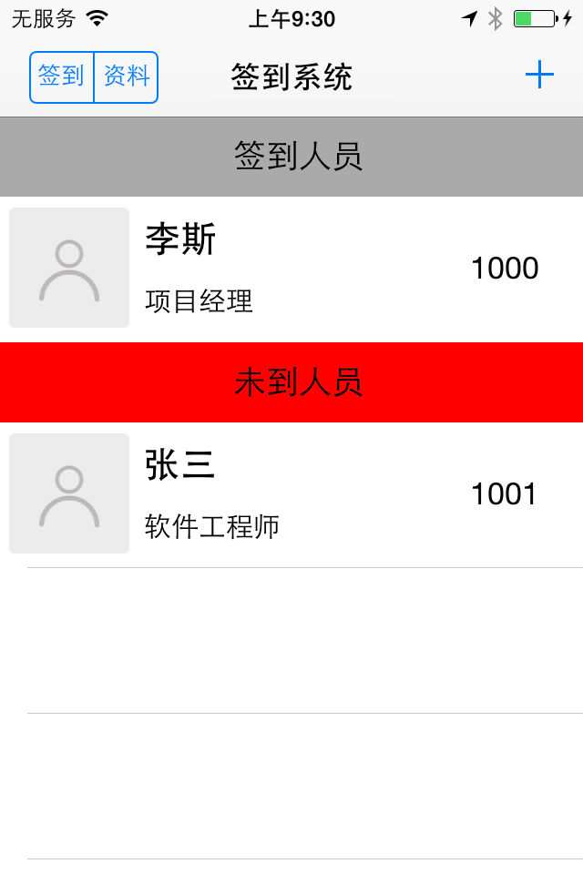
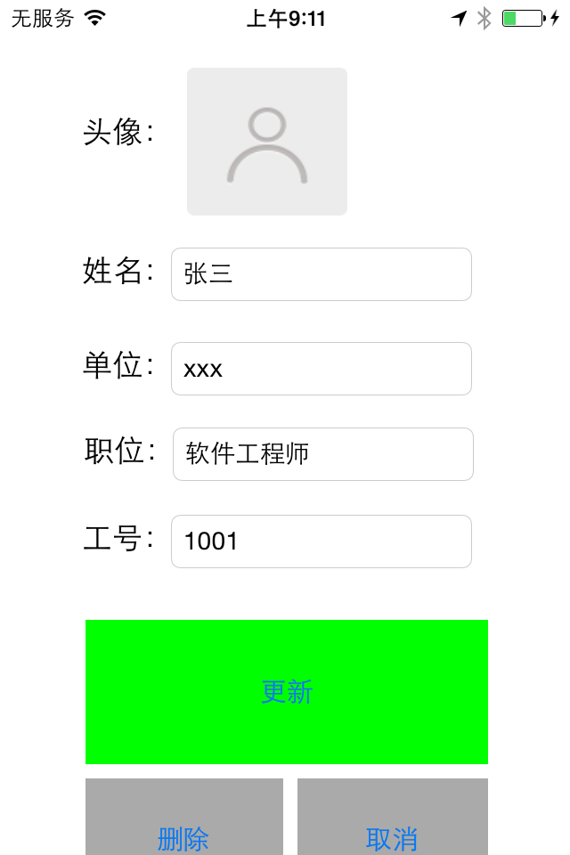
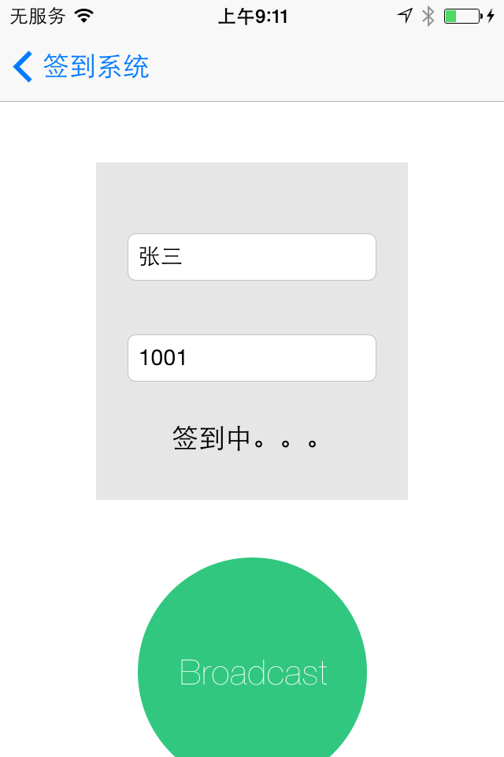
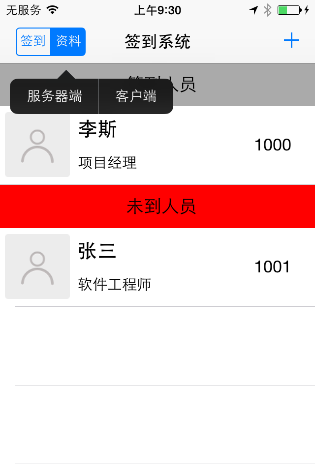
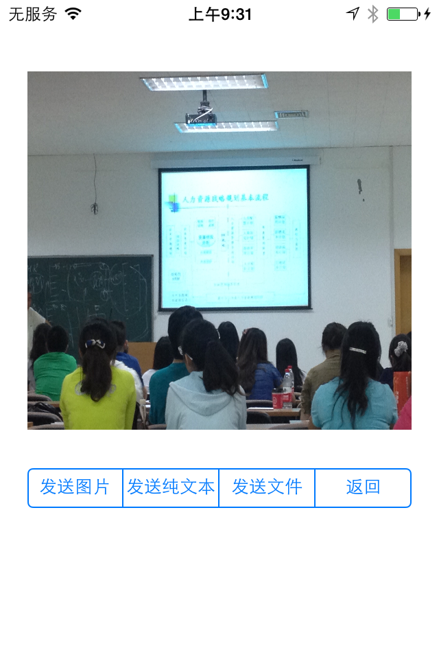

#说明
>本程序是基于ios低功耗蓝牙技术iBeacon，实现无网状态下通过蓝牙模拟简单的签到小程序

##程序概要
首页面展示员工信息、签到状态和一些操作按钮，用户可以点击 ***+*** 添加员工；点击 ***签到*** 按钮签到；点击 ***资料*** 按钮选择发送/接收端；点击 ***单元格*** 实现用户编辑。主要有一下几个页面实现：
1. 首页显示员工信息和签到状态列表

2. 添加员工

3. 删除员工

4. 编辑员工
>{:.some-css-class width="200"}

5. 签到

6. 发送选项

7. 发送和接收信息

##技术实现步骤及注意事项
*** *注意:* ***本程序界面全部通过storyboard添加，并且取消自动布局选项（自动布局的constraint会影响UIScrollView显示）

###数据库操作代理类
把数据库实例信息放在系统的AppDelegate类中，方便其他控制器统一调用，在此之前要先创建数据库中的实体，New file 》Core Data 》 Data model；然后点击左下角的Add Entity，添加数据库员工信息表字段；最后右键Entity选择对Entity的实现类，此处时全自动的，避免实体和实现类不同名，初始化实体失败的现象

	@property(strong, nonatomic) NSManagedObjectModel *managedObjectModel;
	@property(strong, nonatomic) NSManagedObjectContext *managedObjectContext;
	@property(strong, nonatomic) NSPersistentStoreCoordinator *persistentStoreCoordinator;

	-(NSManagedObjectModel *)managedObjectModel;                //初始化数据库实体
	-(NSManagedObjectContext *)managedObjectContext;            //初始化数据库上下文，方便控制器中对数据的CRUD
	-(NSPersistentStoreCoordinator *)persistentStoreCoordinator;//初始化数据库

在控制器viewController中调用上下文操作数据库时可以调用以下代码

	[UIApplication sharedApplication] delegate].managedObjectContext

###首页面RootViewController
1. 是UINavigationViewController + UITableViewController实现。其中table的style选择***plain***时，section会有推拉似的的效果，选择group则类似于静态背景文字  
   在右侧中添加UIBarButtonItem修改Identifer为Add,通过segue连接到AddEmplyeeController,此时可以设置segue切换viewController时的转换方式，一般是***push或者modal***（在xcode6.0以后增加了popover），在选择modal时可以选择转换时的动画效果；
   在左侧的navBar中加入了UISegmentButton，并在didViewAppear中，设置selectedSegmentIndex=-1取消选中状态，通过addTarget为segment添加点击事件方法；
		[self.optionSegmentControl addTarget:self action:@selector(changeOptions:) forControlEvents:UIControlEventValueChanged];

		-(void)changeOptions:(UISegmentedControl *)seg
		{
    		if (seg.selectedSegmentIndex == 0) {...}
		}

	>*注：*storyboard中的UITableViewController默认添加对delegate的实现和设置了
		self.tableview.delegage=self; 
		self.tableview.dataSource=self;

2. 定义三个可变数组，为了存储所有员工、签到员工和未签到员工信息

		NSMutableArray *allEmployees;
    	NSMutableArray *laterEmployees;
    	NSMutableArray *checkInEmployees;

   在viewDidAppear中装载allEmployees，同时根据实际情况设置checkInEmployees和laterEmployyes，然后重新加载表格数据
3. 实现tableView的delegate和datasource
		- (NSInteger)numberOfSectionsInTableView:(UITableView *)tableView
		{
    		return 2; //返回2，分别是0签到员工，1迟到员工
		}

		//可以返回两个UILabel或是UIButton，显示签到和迟到员工section标头
		-(UIView *)tableView:(UITableView *)tableView viewForHeaderInSection:(NSInteger)section；

		//必须实现，可以通过判断section动态返回签到和迟到数组的count
		- (NSInteger)tableView:(UITableView *)tableView numberOfRowsInSection:(NSInteger)section; 
		
		//必须实现，此处根据自定义的EmployeeInfoCell类获取xib显示相应的员工信息
		- (UITableViewCell *)tableView:(UITableView *)tableView cellForRowAtIndexPath:(NSIndexPath *)indexPath
		{
			...

			//以下是通过代码获取xib方法    
			static BOOL nibsRegistered = NO;
    		if (!nibsRegistered) {
        		UINib *nib = [UINib nibWithNibName:@"EmployeeInfoCell" bundle:nil];
        		[tableView registerNib:nib forCellReuseIdentifier:@"EmployeeInfoCell"];
        		nibsRegistered = YES;        
    		}

			...
		}

		//设计section的高度，默认的高度太低，不美观
		-(CGFloat)tableView:(UITableView *)tableView heightForHeaderInSection:(NSInteger)section;
		
		//设计每个员工信息row的高度，可根据头像设置
		- (CGFloat)tableView:(UITableView *)tableView heightForRowAtIndexPath:(NSIndexPath *)indexPath;
		
		//设置每个员工信息是否可编辑
		-(BOOL)tableView:(UITableView *)tableView canEditRowAtIndexPath:(NSIndexPath *)indexPath
		
		//返回编辑时row的style，可以选择delete和insert，此处只涉及到员工删除
		-(UITableViewCellEditingStyle)tableView:(UITableView *)tableView editingStyleForRowAtIndexPath:(NSIndexPath *)indexPath
		{
			return UITableViewCellEditingStyleDelete;
		}

		//设计点击row中编辑按钮时间，此处是点击删除按钮后从员工列表中删除数据，并且从数据中删除
		-(void)tableView:(UITableView *)tableView commitEditingStyle:(UITableViewCellEditingStyle)editingStyle forRowAtIndexPath:(NSIndexPath *)indexPath;
		
		//设计当点击某一条用户信息时的操作，此处当点击时跳转到员工更新页面，并将员工信息传递到更新页面
		-(void)tableView:(UITableView *)tableView didSelectRowAtIndexPath:(NSIndexPath *)indexPath;
可以根据情况自由定制
4. iBeacon分两部分——广播端和接收端; ***广播端*** 发送一个UUID和一个identifier，还可以同时广播一个major值和minor值来区分同一区域不同的分类信息； ***接收端***通过设置一个监听器监听广播，*监听端的UUID必须和广播端的uuid保持一致* ，才能监听到广播，并且通过接收到的不同的major和minor值做不同的操作
此程序的重要部分就是通过iBeacon实现签到的，让承载员工列表设备作为信号接收端，员工签到设备作为信号发送端。员工签到时广播自己的工号，接收端接收到员工编号进行筛选如有匹配的员工，则将员工放到签到的section处，同时从迟到的section中删除
RootViewController作为接收端，CLBeaconRegion初始化监听域，CLLocationManager实施监听，接收端主要要实现CLLocationMamagerDelegate代理的三个方法
	-(void)locationManager:(CLLocationManager *)manager didEnterRegion:(CLRegion *)region
	{
    	//当接收端进入到广播域时要进行的操作，此方法是在后台由ios管理，会默认唤醒程序
	}

	-(void)locationManager:(CLLocationManager *)manager didExitRegion:(CLRegion *)region
	{    
    	//当接收端离开广播域是执行的操作，会默认唤醒程序
   	}

	-(void)locationManager:(CLLocationManager *)manager didRangeBeacons:(NSArray *)beacons inRegion:(CLBeaconRegion *)region
	{
		//当接收端进入域，并开启应用，可以通过接受到的beacon进行筛选，并且对筛选出的beacon通过接收的信号强度(rssi)和虚拟广播端的距离(accuracy)进行操作
	}
>***注：***CLLoactionManagerDelegate中常用方法的执行顺序
didStartMonitoringForRegion>didRangeBeacons>didDetermineState>didRangeBeacons>didEnterRegion>didStartMonitoringForRegion>didDetermineState>didRangeBeacons>didExistRegion

###签到页面CheckInController
	